# RetireWise Documentation

Use this directory as the project study and architecture hub.

## Architecture references

- [Backend workflows](application-flow.md) — layered architecture, startup and
  seeding, dependency injection, routes, CRUD decision flows, contribution-limit
  sequence, error mapping, EF tracking, and current engineering boundaries.
- [Database schema](database-schema.md) — ER diagram, table definitions,
  cardinality, delete behavior, indexes, enum storage, migration flow, and seed
  graph.
- [Client product story](client/product-story.md) — persona, demo journey, page
  inventory, source-of-truth rules, and acceptance criteria.
- [Client component map](client/component-map.md) — route, feature, shared UI,
  and data-flow boundaries.
- [Client state inventory](client/state-inventory.md) — URL, server, local,
  form, and derived-state ownership.
- [Client design system](client/design-system.md) — visual tokens, shared
  primitives, responsive behavior, and accessibility rules.
- [Client API layer](client/api-layer.md) — development proxy, HTTP boundary,
  runtime JSON validation, resource functions, and error taxonomy.
- [Client server state](client/server-state.md) — query keys, option factories,
  caching, cancellation, retry policy, mutations, and invalidation.
- [Client read-only vertical slice](client/read-only-vertical-slice.md) — live
  participant journey, dashboard data flow, and failure behavior.
- [Client write workflows](client/write-workflows.md) — contribution and profile
  forms, validation boundaries, mutation flows, and cache refresh behavior.
- [Client demo readiness](client/demo-readiness.md) — automated tests, recovery,
  accessibility hardening, quality gate, and final demo path.
- [Repository setup and usage](../README.md) — prerequisites, clone, run, API
  examples, endpoint reference, migrations, client commands, and limitations.

## Interactive quizzes

Open [the quiz library](quizzes/index.html) in a browser. It contains nine
static HTML quizzes with 236 self-grading questions and 25 open-ended prompts:

1. [C# and domain modeling](quizzes/csharp-domain-modeling.html)
2. [EF Core and repositories](quizzes/ef-core-repositories.html)
3. [Services, DTOs, and dependency injection](quizzes/services-dtos-di.html)
4. [Controllers and complete workflows](quizzes/controllers-workflows.html)
5. [React and TypeScript foundations](quizzes/react-typescript-foundations.html)
6. [Routing, components, and accessibility](quizzes/routing-components-accessibility.html)
7. [API access, server state, forms, and testing](quizzes/api-query-forms-testing.html)
8. [Full-stack request lifecycle and contracts](quizzes/full-stack-request-lifecycle.html)
9. [Full-stack debugging, evolution, and demo readiness](quizzes/full-stack-debugging-architecture.html)

The collection mixes conceptual questions, altered code snippets, debugging
scenarios, cross-layer workflows, and design tradeoffs. Answers and explanations
appear after each graded quiz is submitted. The pages have no external
dependencies and do not send or store quiz results; open-ended prompts are for
self-review.

## Recommended learning path

```mermaid
flowchart LR
    Models["1. C# entities and relationships"] --> EF["2. EF Core model and repositories"]
    EF --> Services["3. DTOs, services, and DI"]
    Services --> HTTP["4. Controllers and HTTP"]
    HTTP --> React["5. React and TypeScript"]
    React --> ClientData["6. Routing, API state, and forms"]
    ClientData --> Trace["7. Trace full-stack workflows"]
    Trace --> Evaluate["8. Debug, secure, and evolve the system"]
```

After each quiz, inspect the corresponding source folder and explain one
workflow without looking at the diagrams. The goal is to understand why each
boundary exists, not to memorize method names.
