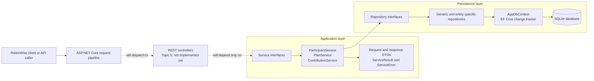
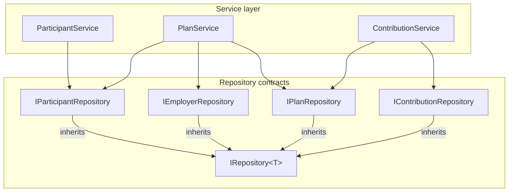
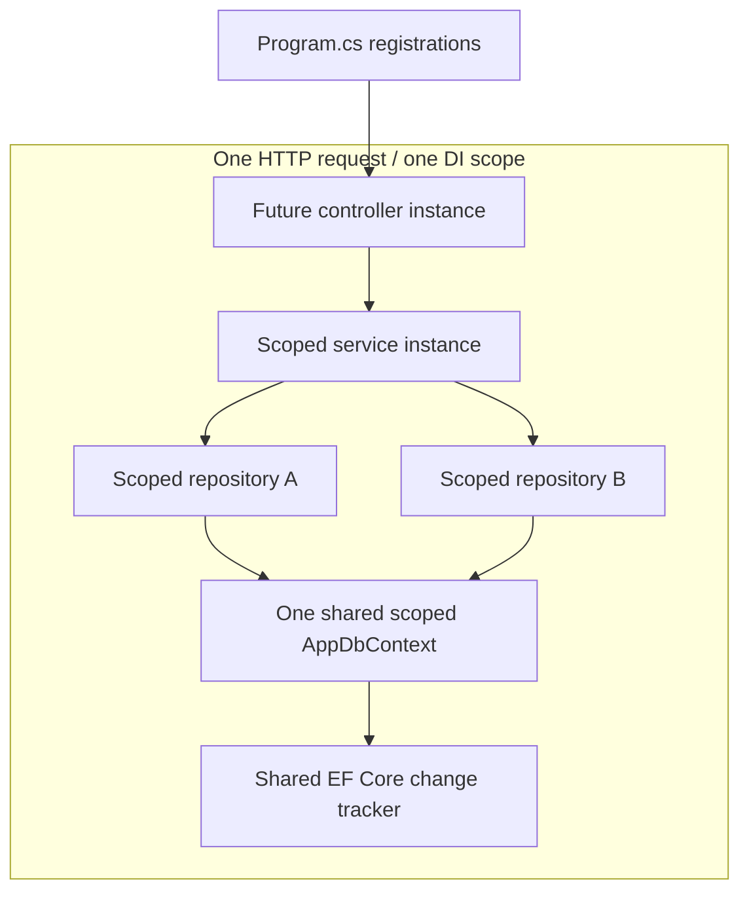
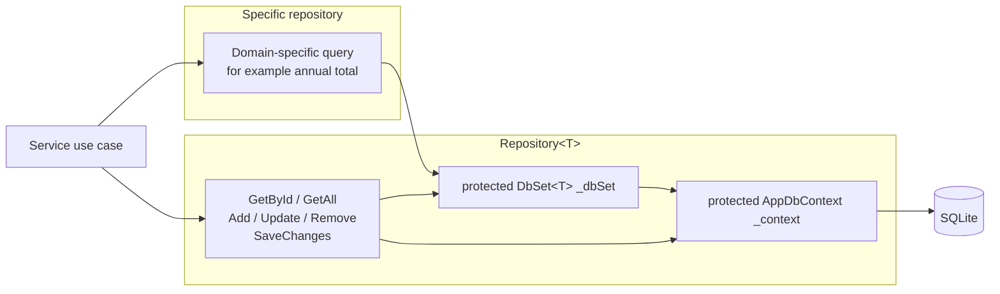
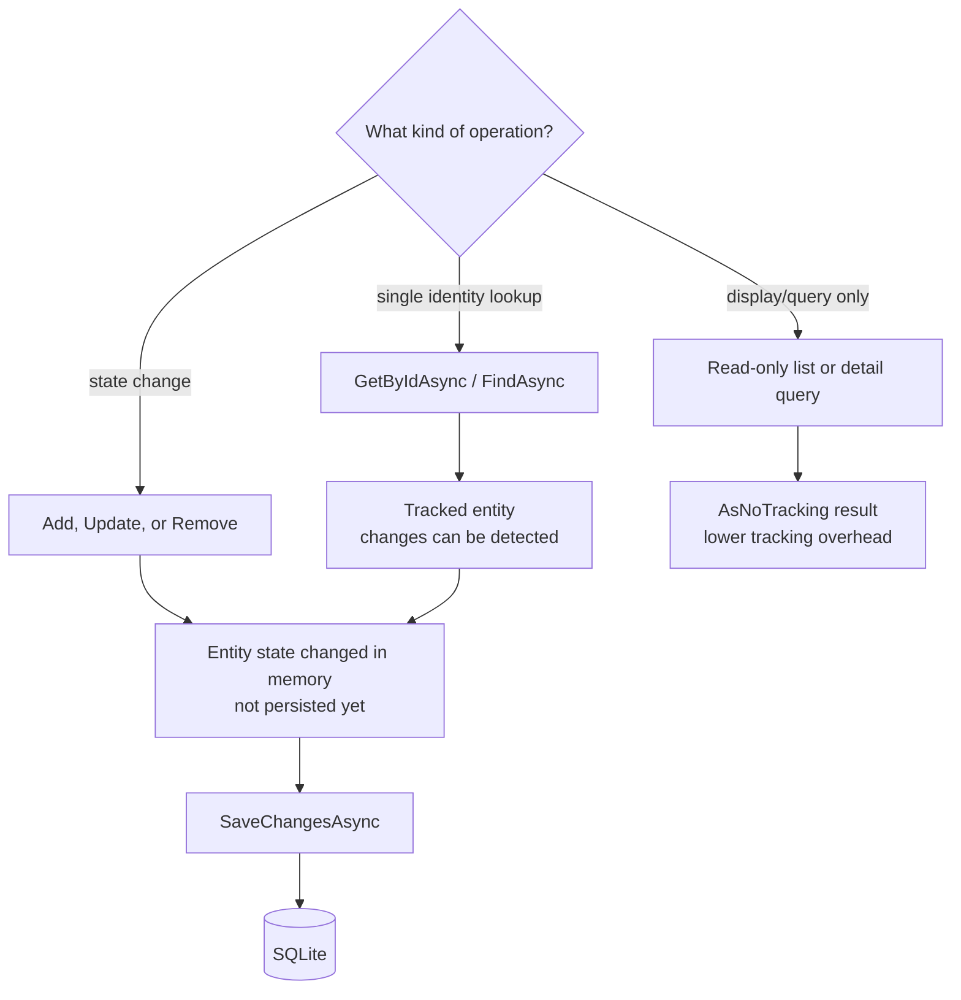
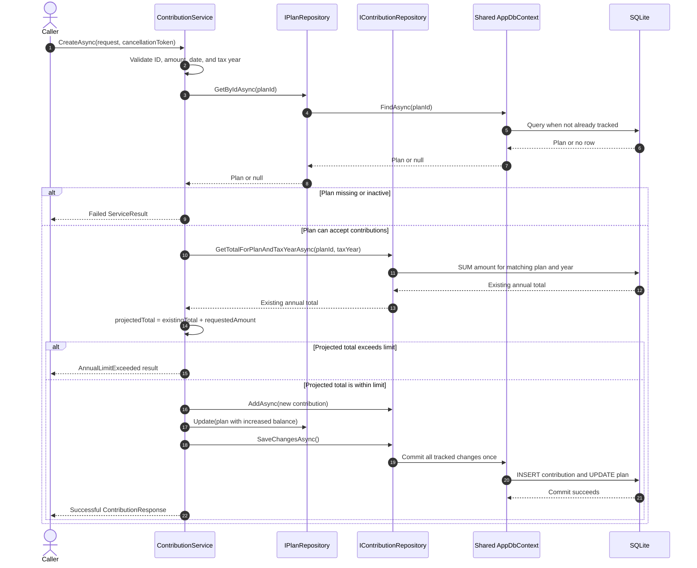
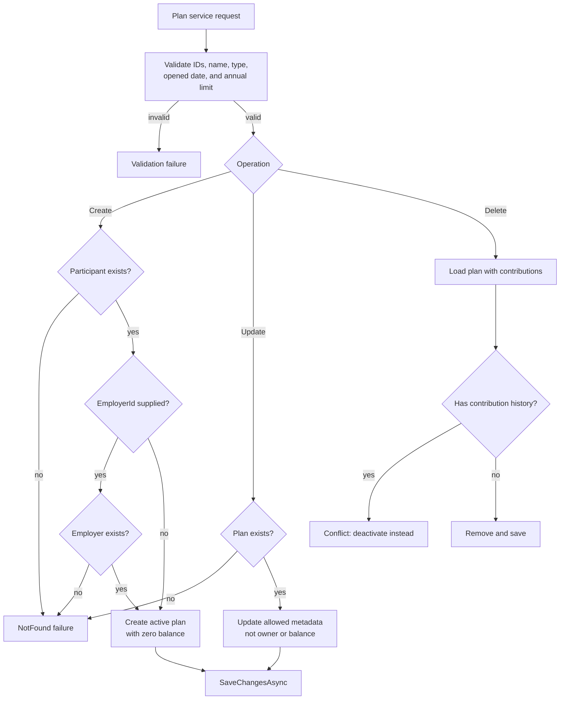
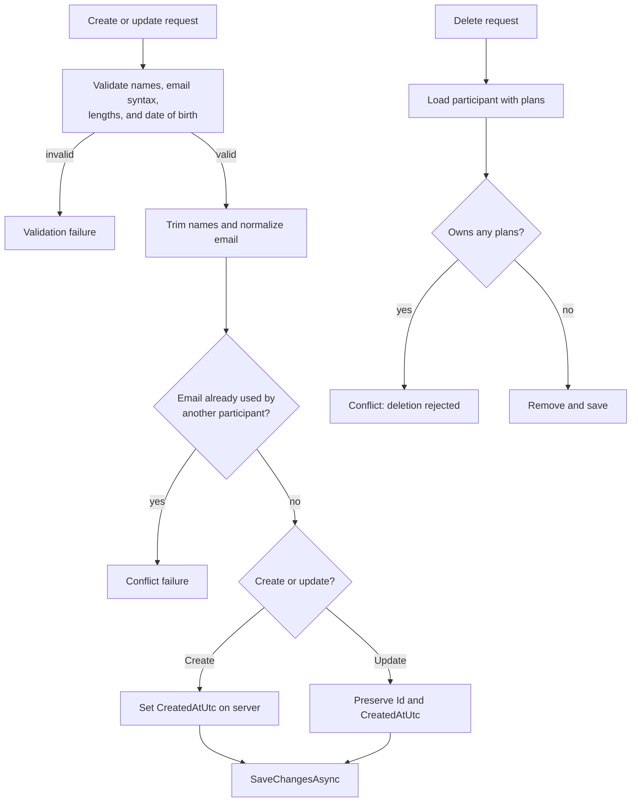
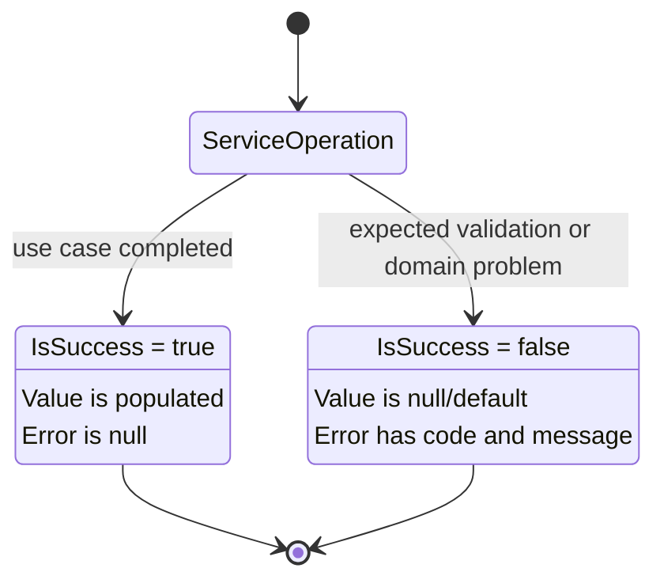

# RetireWise Application Flow

This document shows how the currently implemented backend layers collaborate.
The models, EF Core configuration, repositories, DTOs, services, and dependency
injection registrations exist today. Custom REST controllers are intentionally
shown as the next boundary because they belong to Topic 5 and have not yet been
implemented.

## Layered architecture



The arrows represent allowed dependencies. Controllers should not skip the
service layer to call repositories or `AppDbContext`. Repositories should not
contain annual-limit rules or HTTP behavior.

## Service dependency graph



Each service receives interfaces through constructor injection. This keeps the
service unaware of EF Core implementation details and allows a different
implementation or test double to satisfy the same contract.

## Dependency injection and scoped lifetime



The shared scoped context is important for `ContributionService`. The plan
repository can track a balance change while the contribution repository tracks
a new contribution. A single `SaveChangesAsync` commits both pending changes.

## Generic and specific repository flow



`protected` allows derived repositories to reuse `_dbSet` and `_context`
without making those fields public to unrelated callers. The generic repository
handles operations shared by every entity. Specific repositories add queries
that only make sense for one entity, such as summing contributions by plan and
tax year.

## Query behavior and tracking



`AddAsync`, `Update`, and `Remove` change EF Core's tracked state. They do not
guarantee persistence until `SaveChangesAsync` succeeds.

## Contribution creation and annual-limit rule



The rule compares the projected total with the stored plan limit:

```text
existing total + requested amount > annual limit  => reject
existing total + requested amount == annual limit => accept
existing total + requested amount < annual limit  => accept
```

Only contributions for the same plan and tax year are included. A rejected
request never calls `AddAsync` or `SaveChangesAsync`.

## Plan-service decision flow



The nullable employer ID permits an individual account. Participant ownership
and current balance are intentionally absent from the update DTO so an ordinary
metadata update cannot transfer an account or rewrite financial state.

## Participant-service decision flow



The pre-save email check provides a useful business error. The database's
unique index remains the final protection against duplicate values.

## Service result states



The private `ServiceResult<T>` constructor and public static factory methods
prevent callers from freely constructing contradictory result states. Topic 5
controllers will translate these error codes into HTTP status codes.

## Current boundary and known limitation

The service and persistence layers are registered and compile, but custom
controllers are not implemented yet. Therefore the current architecture is
ready to receive HTTP endpoints, but the client cannot yet invoke these use
cases through REST.

The annual-limit check is also a read-then-write operation. Two concurrent
requests could read the same existing total and both pass before either saves.
A production implementation would study transaction isolation, optimistic
concurrency, or a database-enforced aggregate strategy.
