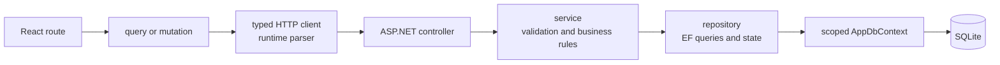
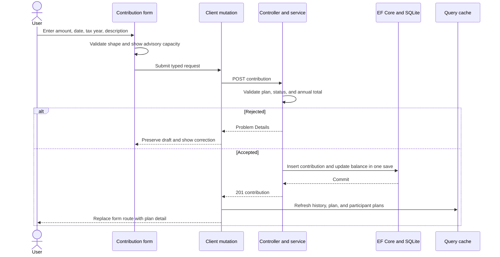

# RetireWise Workflows

This guide documents the boundaries and user-facing workflows that are easy to
lose when reading individual files. Endpoint details live in the
[API reference](../SmartRetirement.Api/README.md); persistence details live in
the [database schema](database-schema.md).

## Boundaries

| Boundary | Responsibility |
| --- | --- |
| Route and form | URL parsing, local drafts, presentation, accessible feedback |
| Query and HTTP client | Server-state caching, cancellation, JSON validation |
| Controller | Routing, success status, Problem Details translation |
| Service | Validation, authorization-independent use cases, DTO mapping, business rules |
| Repository and EF Core | Queries, relationships, tracked changes, persistence |

The API is authoritative. Client calculations improve feedback but never replace
server validation.

## Participant read

1. The client validates the participant ID before sending a request.
2. `ParticipantLayout` verifies the participant and renders the shared shell.
3. Nested pages query plans and, where needed, contribution histories.
4. Runtime parsers validate successful JSON before TanStack Query caches it.
5. Pure selectors derive combined balances, annual totals, and remaining
   capacity without modifying cached data.
6. Plan pages reject a valid plan ID when it does not belong to the participant
   identified by the route.

Contribution-history requests can fail independently; plan balances remain
visible while the affected history exposes a retry action.

## Contribution write

The annual total is scoped to one plan and tax year. Equality with the limit is
accepted; only a projected total above the limit is rejected.

## Profile write

The form validates names, email, and date of birth, then sends only editable
fields. The service normalizes the email and enforces uniqueness while
preserving the participant ID and creation timestamp. On success, the client
replaces participant detail in the cache and refreshes the chooser. Any failure
preserves the draft.

## Failure ownership

| Failure | Handling |
| --- | --- |
| Invalid route or form value | Client blocks the request and identifies the field or route |
| Expected service failure | API returns structured `400`, `404`, or `409` Problem Details |
| Network failure | Client preserves useful state and offers retry where safe |
| Invalid success JSON | Runtime parser rejects the response as a contract error |
| Unexpected exception or render failure | Server middleware or client error boundary provides generic recovery |
