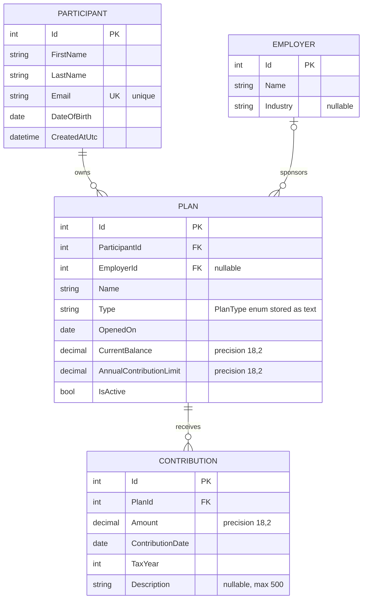

# RetireWise Database Schema

This diagram reflects the current EF Core entity model and Fluent API
configuration in `SmartRetirement.Api`.

For request flow, dependency injection, repository behavior, and service
business rules, see [Application Flow](application-flow.md).

## Relationship interpretation

- A participant can own zero or many plans; every plan has exactly one
  participant.
- An employer can sponsor zero or many plans; a plan may have zero or one
  employer so individual accounts remain valid.
- A plan can receive zero or many contributions; every contribution belongs to
  exactly one plan.

## Delete behavior

| Principal | Dependent | Behavior | Result |
| --- | --- | --- | --- |
| Participant | Plan | `Restrict` | A participant cannot be deleted while plans reference them. |
| Employer | Plan | `SetNull` | Deleting an employer preserves its plans and clears their `EmployerId`. |
| Plan | Contribution | `Restrict` | A plan cannot be deleted while contribution history references it. |

## Constraints and indexes

- `Participant.Email` has a unique index.
- `Contribution` has a composite index on `(PlanId, TaxYear)` to support annual
  contribution-limit calculations.
- Required names have configured maximum lengths; `Industry` and `Description`
  are optional.
- `Plan.Type` is stored as text using the values `Unknown`, `K401`, `IRA`,
  `HSA`, `Education529`, and `Able`.

## Important modeling note

`Plan` represents a participant-owned account, not a shared employer plan
offering. If the domain later needs shared offerings with multiple enrolled
participants, introduce a separate enrollment entity rather than changing this
relationship into an implicit many-to-many association.
